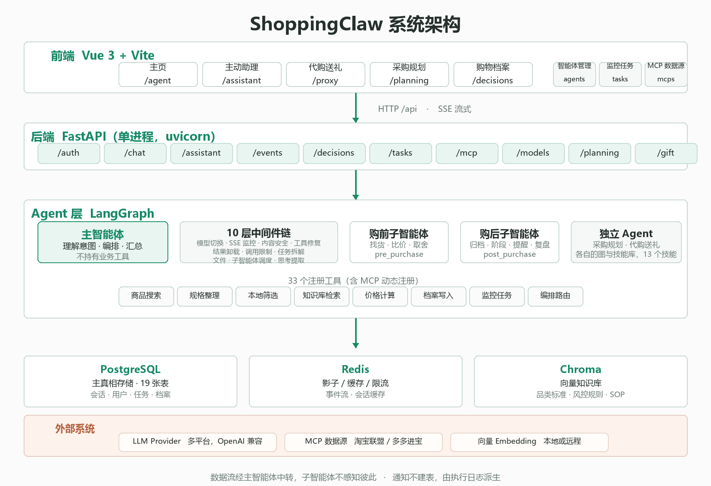

<div align="center">


# ShoppingClaw

电商购物决策智能体。用自然语言提需求，系统负责找货、比价、取舍、归档、盯价。

[](LICENSE)
[](https://www.python.org/)
[](https://vuejs.org/)
[](https://github.com/langchain-ai/langgraph)
[](https://fastapi.tiangolo.com/)

[这是什么](#这是什么) · [快速开始](#快速开始) · [架构](#架构) · [定时监控](#定时监控) · [文档](#文档) · [FAQ](#faq)

</div>

---

> [!WARNING]
> - 会调用真实电商联盟 API（淘宝联盟 / 多多进宝）和真实 LLM，密钥写进 `.env`，别提交。
> - 定时监控会周期性发外部请求，注意接口配额和平台规则。
> - 价格、库存来自第三方接口，下单前以平台页面为准。

<!--
  ═══════════════════════════════════════════════════════════
  截图占位：图片补好后，删掉本段注释的首尾两行（HTML 注释标记）即可显示
  建议放 2 张：
    ① screenshot-chat.png  对话主界面（SSE 流式 + 思考可视化 + 编排状态）
    ② screenshot-graph.png 决策图（采购规划的实时生长图）
  放到 docs/assets/ 目录下，宽度 1600px 左右即可
  ═══════════════════════════════════════════════════════════

<p align="center">
  
  
</p>

-->

## 这是什么

基于 LangGraph 的多智能体系统，覆盖购物的完整生命周期。

**买之前**，购前子智能体搜实时商品、整理规格、按预算和硬约束筛选，给出取舍建议和风险提示。工具没返回的字段一律留空——宁可少推一款，不编造一款。

**买之后**，购后子智能体把结论存进购物档案，按需建盯价任务、设提醒、写复盘。档案分五个阶段（需求池 → 候选中 → 已决策 → 使用中 → 已复盘），下次聊到同一件商品时它记得。

**成套采购**（装修、搬家、开学）和**代购送礼**是两个独立 Agent，各自有技能库和交付物，不走主对话。

商品数据通过 MCP 接入淘宝联盟和多多进宝，实时抓取。

---

## 快速开始

前置：Docker Engine + Docker Compose v2，以及至少一个 OpenAI 兼容的 LLM API Key。

```bash
git clone https://github.com/LuFering/ShoppingClaw.git
cd ShoppingClaw
cp .env.template .env        # 至少填一个 LLM key
docker compose up -d
docker compose ps            # 等 api 变成 healthy
```

API 文档 http://localhost:5050/docs，健康检查 http://localhost:5050/api/system/health。

首次启动数据库是空的，先建管理员：

```bash
curl -X POST http://localhost:5050/api/auth/initialize \
  -H 'Content-Type: application/json' \
  -d '{"username":"admin","password":"your-password"}'
```

前端开发模式（后端仍在 Docker 里）：

```bash
cd web-v2
npm ci && npm run dev        # http://localhost:5173
```

不用 Docker 也行，需要本机 Python 3.12+ 和 uv：

```bash
uv sync
uv run --no-dev uvicorn server.main:app --host 0.0.0.0 --port 5050
```

`server/`、`src/`、`docs/` 是 bind mount 进容器的，改完代码 `docker compose restart api` 生效，不用重建镜像。

---

## 架构

<!--
  ═══════════════════════════════════════════════════════════
  架构图占位：图片补好后，删掉本段注释的首尾两行即可显示。

  为什么用静态图而不是 Mermaid：调研 8 个标杆仓库（LangGraph / OpenHands /
  RAGFlow / FastGPT / crewAI 等），Mermaid 使用率 0/8 —— 它依赖客户端 JS
  渲染，在镜像站、爬虫、部分移动端看不到。可用 draw.io / Excalidraw 画好导出。
  ═══════════════════════════════════════════════════════════

<p align="center">
  
</p>

-->

前端 Vue 3，后端 FastAPI 单进程，PostgreSQL 存会话/用户/任务/档案，Redis 做缓存和限流，Chroma 存向量知识库。

### 主智能体和它的中间件

主智能体不持有任何业务工具——搜索、出卡、归档都在子智能体里。它只做三件事：理解意图、派发子智能体、汇总结果。所以身上可以挂一层完整的中间件链，每层管一件事：

| 顺序 | 中间件 | 作用 |
| --- | --- | --- |
| 0 | `DynamicModelMiddleware` | 按请求切模型 |
| 1 | `SSEMonitoringMiddleware` | 捕获所有工具调用，供前端展示 |
| 2 | `ContentGuardMiddleware` | 内容安全审查 |
| 3 | `PatchToolCallsMiddleware` | 修模型输出的工具调用格式 |
| 4 | `ToolResultOffloadMiddleware` | 大结果卸载，避免撑爆上下文 |
| 5 | `ToolCallLimitMiddleware` | 调用次数限制（单轮 10 次 / 线程 20 次） |
| 6 | `TodoListMiddleware` | 任务拆解 |
| 7 | `FilesystemMiddleware` | 文件读写 |
| 8 | `SubAgentMiddleware` | 子智能体调度 |
| 9 | `ThinkingProcessMiddleware` | 提取思考过程，前端可视化 |

### 三层 Agent

| | 数量 | 职责 | 入口 |
| --- | --- | --- | --- |
| 主智能体 | 1 | 理解意图、编排、汇总。不持有业务工具 | 所有对话 |
| 子智能体 | 2 | 购前找货取舍 / 购后归档盯价，以 Tool 形式被调用 | 主智能体按需派发 |
| 独立 Agent | 2 | 采购规划 / 代购送礼，有各自的图和技能库 | 用户直接进页面 |

采购规划和代购送礼没做成子智能体，因为它们是长流程（多轮澄清、决策图、多份交付物），塞进对话会被主智能体的单轮节奏切碎。

---

## 功能页面

| 区域 | 页面 | 做什么 |
| --- | --- | --- |
| 主区 | 主页 `/agent` | 对话。SSE 流式输出，思考和工具调用实时可见 |
| | 主动助理 `/assistant` | 简报、情报流、待办 |
| | 代购送礼 `/proxy` | 建人物档案 → 选礼 → 交付 |
| | 采购规划 `/planning` | 需求 → 决策图 → 交付物（报告 / 清单 / 预算，可导出 PDF） |
| | 购物档案 `/decisions` | 五阶段状态机 |
| 系统区 | 智能体管理 `/agents` | Agent 配置与模型绑定 |
| | 监控任务 `/tasks` | 任务 CRUD、执行日志、价格历史曲线 |
| | MCP 数据源 `/mcps` | MCP 服务器管理与工具发现 |

---

## 定时监控

主动助理的核心。7 类执行器，都走真实数据源：

| 执行器 | 监控什么 | 什么时候通知 |
| --- | --- | --- |
| `price` | 商品价格 | 降到目标价，或 7 天跌超 5% |
| `stock` | 库存 | 缺货 ↔ 有货 状态翻转 |
| `coupon` | 优惠券 | 出现超过商品价 50% 的大额券 |
| `deal` | 优惠到期 | 券或活动快失效 |
| `rank` | 榜单排名 | 变动 3 位以上 |
| `shop` | 店铺活动 | 折扣超过 30% |
| `agent` | AI 汇总 | 按 prompt 跑一轮完整对话 |

价格没变不推，排名微动不推。但执行失败一定推——配了监控却悄悄不跑了，比不推更糟。

---

## 技术栈

| 层 | 技术 |
| --- | --- |
| 后端 | Python 3.12 · FastAPI · LangChain / LangGraph · SQLAlchemy(async) · APScheduler · uv |
| 前端 | Vue 3 · Vite 7 · Ant Design Vue 4 · ECharts 6 · AntV G6 5 · Sigma · Graphology |
| 存储 | PostgreSQL（主，JSONB 事件溯源） · Redis（缓存 / 限流） · Chroma（向量库） |
| 外部 | 多 LLM Provider · MCP（淘宝联盟 / 多多进宝） |
| 部署 | Docker Compose · Nginx |

规模：后端 447 个 Python 文件约 5.4 万行，前端 158 个文件约 4.2 万行，19 张表，33 个注册工具，13 个技能。

---

## FAQ

<details>
<summary>和 Dify / Coze / FastGPT 有什么区别？</summary>

那些是通用 Agent 编排平台，用来搭任何应用；这个是垂直的电商系统，开箱就是购物场景。

差别主要在两处：购物档案有五阶段状态机，商品会被跟踪到「买了、用了、复盘了」；定时监控持续盯价，用户不在线也在跑。这两套在通用平台上要自己搭。
</details>

<details>
<summary>支持哪些模型？能本地跑吗？</summary>

任何 OpenAI 兼容接口的都可以：OpenAI、DeepSeek、通义千问、智谱、商汤、OpenRouter，Ollama 本地模型也行。

在 `.env` 配 provider 的 `base_url` 和 key，然后在「智能体管理」页给每个 Agent 分别绑定。也支持按请求临时切模型。
</details>

<details>
<summary>数据存在哪？会上传到云端吗？</summary>

全部在你自己的 PostgreSQL 里，不经过第三方服务器：

- 会话消息 `conversations`
- 购物档案 `shopping_decisions`
- 定时任务 `task_records` / `task_execution_logs`
- 向量库本地 Chroma

唯一的外部调用是你自己配的 LLM API 和电商数据接口。
</details>

<details>
<summary>为什么用 MCP 而不是直接集成电商 SDK？</summary>

MCP 把数据源做成可插拔的独立进程：加数据源不用改代码，凭据留在子进程的环境变量里不进主进程，MCP 挂了也不影响核心对话。

早期确实直接集成过京东 SDK，但价格接口无授权、返回字段里没有价格，最后整体下架改成 MCP。代码还留在 `src/jd/` 供参考。
</details>

---

## 文档

| 我想… | 去哪 |
| --- | --- |
| 先跑起来 | [快速开始](docs/intro/quick-start.md) |
| 了解系统全貌 | [项目概览](docs/intro/overview.md) |
| 看后端怎么分层 | [后端架构](docs/architecture/backend.md) |
| 理解数据怎么存 | [存储与持久化](docs/architecture/storage.md) |
| 对接接口 | [API 约定](docs/api/index.md) · [对话接口](docs/api/chat.md) |
| 改代码 | [后端指南](docs/development/backend-guide.md) · [前端指南](docs/development/frontend-guide.md) |
| 部署 / 排障 | [部署运维](docs/operations/deployment.md) · [故障手册](docs/operations/troubleshooting.md) |
| 全部文档导航 | [docs/index.md](docs/index.md) |

---

## 贡献

欢迎提 Issue 和 PR。动手前先读 [CONTRIBUTING.md](CONTRIBUTING.md) 和 [AGENTS.md](AGENTS.md)——后者是给 AI 编码助手与人类协作者的硬性规则，含架构铁律和高频修改点对照。

```bash
docker compose up -d          # 全栈启动，代码热重载
docker compose logs -f api    # 看日志
```

---

## 许可

[MIT License](LICENSE) © 2026 LuFering

致谢：

- [DeepAgents](https://github.com/langchain-ai/deepagents) —— Agent 中间件链与沙盒设计
- [LangGraph](https://github.com/langchain-ai/langgraph) —— 多智能体图编排
- [MCP](https://modelcontextprotocol.io/) 生态，电商数据源基于 [sinataoke](https://mcp.sinataoke.cn/docs)（淘宝联盟 / 多多进宝）

<div align="right"><a href="#shoppingclaw">↑ 回到顶部</a></div>
