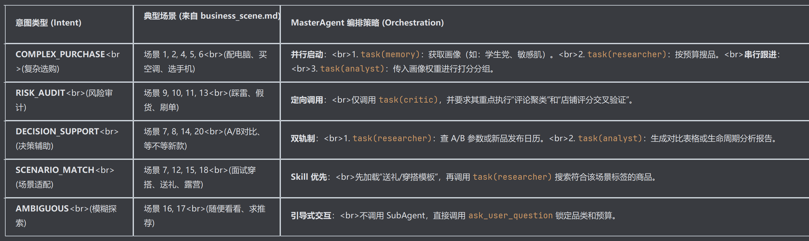

基于 `joyai_prompt.md` 的工业级实践和 `business_scene.md` 的全场景覆盖，我对 MasterAgent 和 SubAgent 的**意图识别与协作逻辑**提出以下深度优化方案：

### 1. MasterAgent：从“简单路由”进化为“意图-策略映射器”

MasterAgent 不应只是转发消息，它必须是一个**业务逻辑编译器**。参考 JoyAI 的 Skills 系统，建议将意图识别细化为以下 5 类，并对应不同的 SubAgent 编排策略：

---

### 2. SubAgent：针对“广泛场景”的专业化改造

为了覆盖 `business_scene.md` 中的 20+ 场景，SubAgent 必须具备**领域感知能力**：

#### **Researcher Agent：多维信息猎手**
*   **优化点**：不能只搜商品标题。
*   **新增能力**：
    *   **跨源验证**：针对“风险规避类”场景，必须并行调用 `web_search`（查口碑）和 `jd_product_search`（查价格）。
    *   **生命周期查询**：针对“要不要等新款”场景，增加对“产品发布日期”和“迭代周期”的搜索指令。

#### **Analyst Agent：利益点翻译官**
*   **优化点**：从“参数罗列”转向“体验翻译”。
*   **新增能力**：
    *   **场景化映射**：在 Prompt 中植入映射表。例如：用户说“宿舍用”，Analyst 应自动将“噪音分贝”和“便携性”的权重调高；用户说“送老师”，则调高“包装精美度”和“品牌知名度”。
    *   **动态分组**：不再固定分 3 组，而是根据场景命名。如送礼场景分为：“体面大方组”、“实用贴心组”、“创意惊喜组”。

#### **Critic Agent：风控守门员**
*   **优化点**：从“价格过滤”转向“深度审计”。
*   **新增能力**：
    *   **水军识别**：针对“评论是不是刷的”，要求 Critic 分析评论的时间分布和关键词重复率。
    *   **售后复杂度评估**：针对“退货麻烦吗”，要求 Critic 检索该品牌的退换货政策及历史投诉记录。

### 1. Memory Agent 的核心职责
*   **画像建模 (Profiling)**：从历史对话中提取用户的消费风格（如：价格敏感型、品质追求型、品牌忠诚型）。
*   **上下文检索 (Retrieval)**：根据当前 Query，精准提取相关的历史偏好（如：用户上次说“不喜欢苹果”，这次搜手机时自动过滤）。
*   **意图持久化 (Persistence)**：将本轮对话中产生的新偏好（如：“我觉得华为的拍照不错”）结构化并存入数据库。

---

### 3. 核心修改动作：如何落地？

#### **第一步：优化 `BASE_PROMPT.md` 的意图定义**
在 MasterAgent 的 Prompt 中加入**“意图-工具映射表”**：
> “当你识别到用户在询问‘风险’、‘真假’、‘靠谱’时，你的唯一目标是调用 `critic` 专家。当你识别到用户在‘纠结’、‘对比’时，你必须先调用 `researcher` 补齐数据，再调用 `analyst` 产出对比结论。”

#### **第二步：强化 SubAgent 的 `system_prompt` 场景感**
在 `subagents.yaml` 中，为每个 Agent 增加**“场景处理准则”**：
*   **Analyst**: “如果用户提到‘送礼’，请在推荐理由中强调‘包装’和‘品牌认知度’；如果用户提到‘自用’，请强调‘性价比’和‘耐用性’。”
*   **Researcher**: “如果用户关注‘长期使用’，请优先搜索‘耐用性测评’和‘二手保值率’相关词条。”

#### **第三步：实现“宁缺毋滥”的反馈机制**
参考 JoyAI 的“客观与宁缺毋滥”原则，在 MasterAgent 中增加逻辑：
> “如果 `researcher` 返回的结果为空，或者 `analyst` 认为没有商品能满足用户的‘红线需求’（如预算严重不足），请直接告知用户现实情况，并提供‘调整预算’或‘降低预期’的建议，严禁硬推不匹配的商品。”

### 4. MasterAgent 如何编排 Memory Agent？

参考 JoyAI 的“并行执行”原则，MasterAgent 在处理复杂场景时应这样调度：

#### **场景 A：复杂选购（如“配台游戏电脑”）**
*   **Step 1 (并行)**: 
    *   `task(memory, description="提取用户对电脑品牌、预算上限、性能侧重的历史偏好")`
    *   `task(researcher, description="搜索当前热门的游戏本配置")`
*   **Step 2 (串行)**: 
    *   MasterAgent 拿到 Memory 返回的 `preference_vector` 后，将其作为 `criteria` 传给 `analyst`。
    *   `task(analyst, description="根据提供的偏好权重对商品进行打分")`

#### **场景 B：风险规避（如“这个店靠谱吗”）**
*   **Step 1 (串行)**: 
    *   `task(memory, description="查询该用户过去是否在该平台有过不愉快的购物经历或对售后的特殊要求")`
*   **Step 2 (串行)**: 
    *   `task(critic, description="结合用户的售后敏感度，深度审计该店铺的投诉记录")`

### 5. 数据流转架构图 (文本版)

1.  **User Input**: "我想买个降噪耳机，但我不喜欢入耳式的。"
2.  **MasterAgent**: 识别意图 -> 并行呼叫 Memory & Researcher。
3.  **Memory Agent**: 
    *   调用 `retrieve_preference_vector` -> 发现用户有“佩戴舒适度”高权重。
    *   调用 `update_user_preference` -> 记录新标签 `{"form_factor": "over-ear"}`。
    *   **返回**: `{"comfort_weight": 0.9, "form_factor": "over-ear"}`。
4.  **Researcher Agent**: 搜索“头戴式降噪耳机”。
5.  **Analyst Agent**: 收到 Memory 的权重，将“佩戴舒适度”和“夹头感”作为核心淘汰指标。
6.  **MasterAgent**: 综合输出建议。
